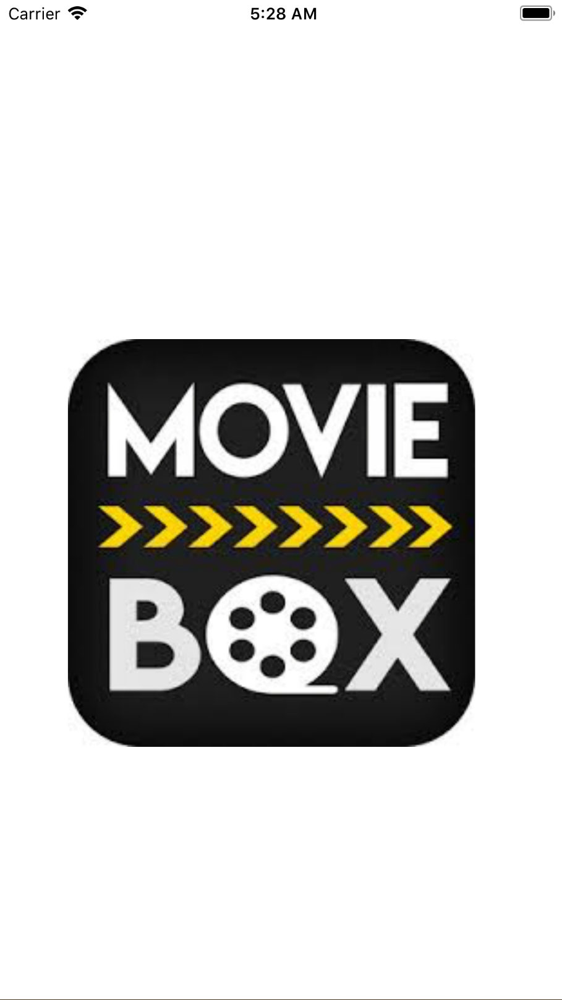
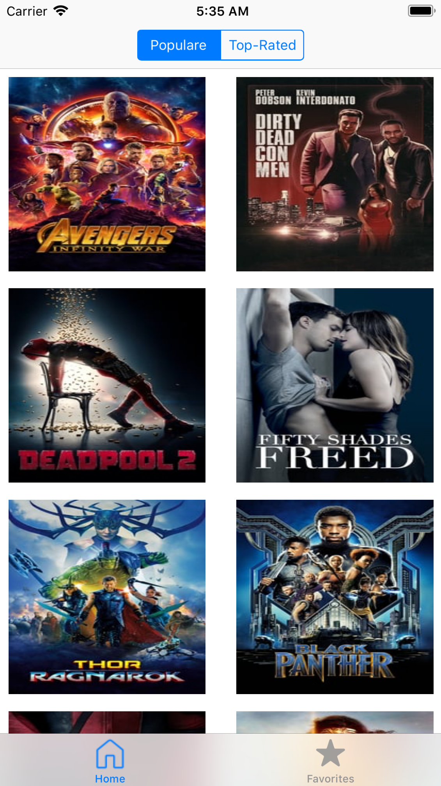
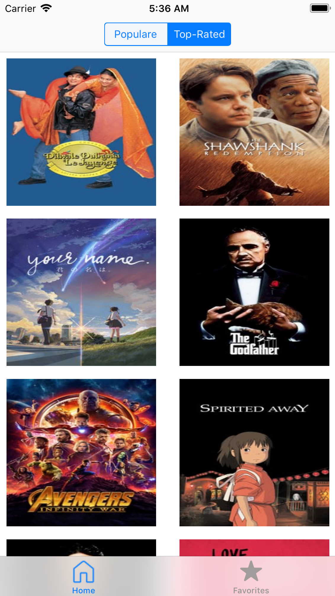
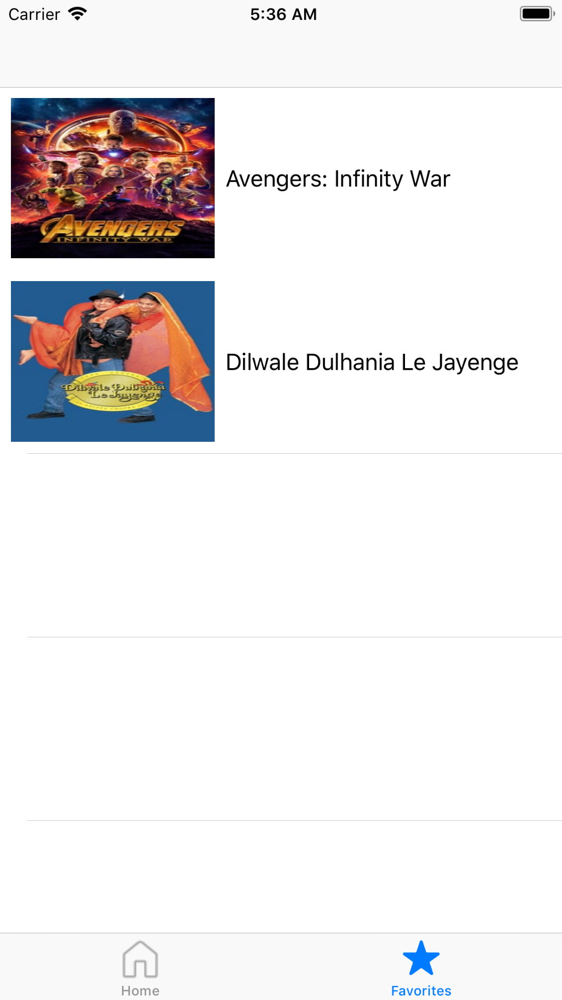
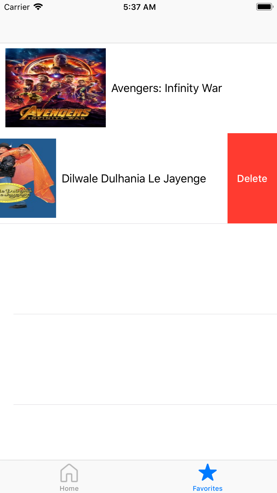
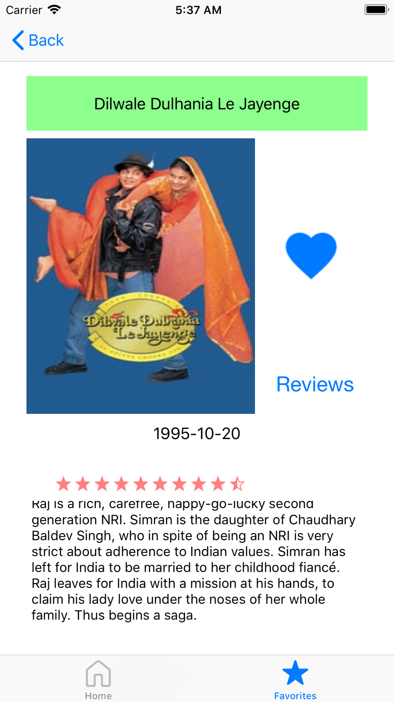
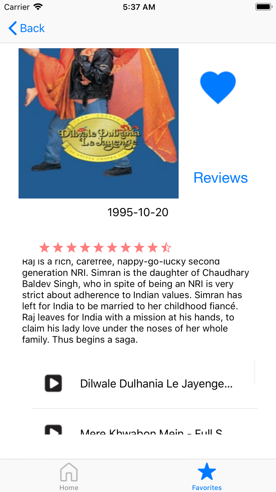
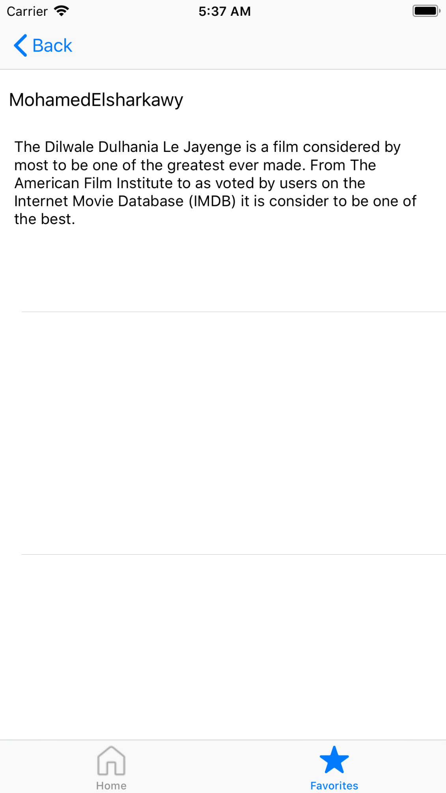
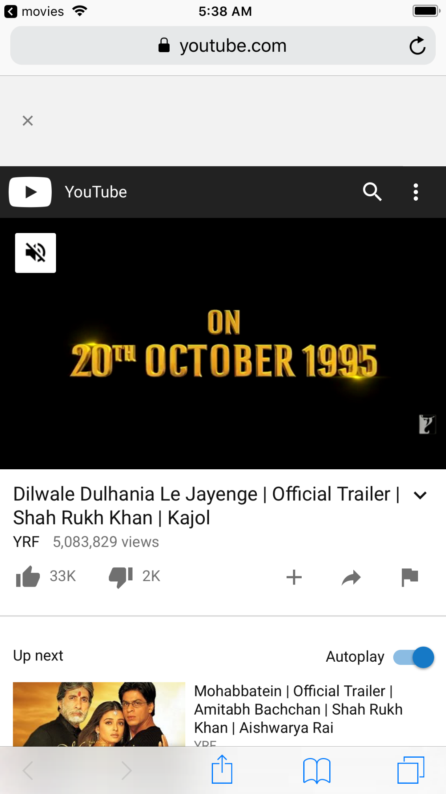

# movies-DB-IOS
this application is using movie-DB api to list the user the top 20 movies they are sorted in two categories 1.popular 2.top-rated user can watch movie detailes and the trailers to it and reviews and can store the movie in liked list and application uses sqlite3,AFNetworking,SDWebImage,JSONModel and HCSStarRatingView and it written in Objective-C
ScreenShots
1- welcome screen

2-home (populare sort)

3-home (top-rated sort)

4-favorites

5-delete from favorites

6-movie details

7-reviews on movie

8- play trailer

